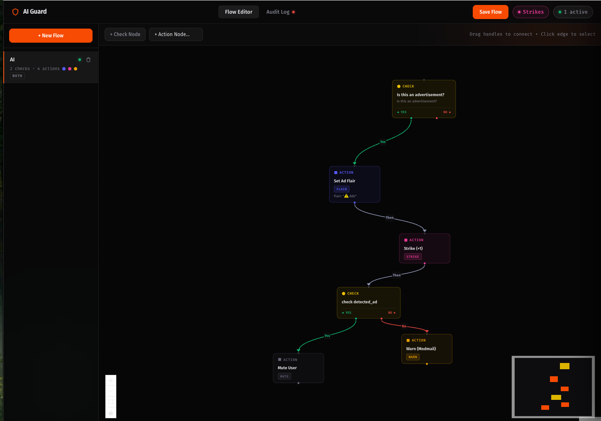

# AI Guard — Visual AI Moderation for Reddit

AI Guard lets moderators build visual, AI-powered moderation workflows that automatically review posts and comments and take action — no coding required.

Connect an AI check to any moderation action (remove, ban, flair, warn, mute, strike) using a drag-and-drop flow editor. Every decision is logged in a 30-day audit trail so you always know what happened and why.

---

## Features

### Visual Flow Editor
Build moderation logic like a flowchart. Drag nodes onto a canvas, connect them with Yes/No edges, and save. Flows run automatically on every new post and comment in your subreddit.

### AI Check Nodes
Write a plain-English prompt describing what to detect — spam, hate speech, off-topic content, anything. AI Guard calls your configured LLM and routes the content based on the verdict.

### Strike System
Track repeat offenders across any category you define (spam, harassment, brigading). Use strike check nodes to trigger escalating consequences — warn on the first strike, ban on the third.

### Audit Log
Every flow execution is recorded with the author, a content preview, which flow ran, the AI's verdict and reasoning, and what action was taken. Paginated, searchable, and filtered by action type. Data is retained for 30 days.

### Multiple Actions per Flow
Chain action nodes together — remove a post, add a strike, and send a modmail warning all in one flow.

---

## Setup

### 1. Install the app
Install AI Guard from the Reddit app directory onto your subreddit.

### 2. Configure your API key
Go to **Mod Tools → Apps → AI Guard → App Settings** and fill in:

| Setting | Description |
|---|---|
| API Key | Your OpenAI key (`sk-...`) or Google AI Studio key |
| Base URL | Leave default for OpenAI. For Gemini: `https://generativelanguage.googleapis.com/v1beta/openai` |
| Model Name | e.g. `gpt-4o-mini`, `gemini-2.0-flash`, `gemini-1.5-pro` |

### 3. Open the Flow Editor
Go to your subreddit → **Mod Tools** → **Manage Moderation Flows**.

### 4. Create your first flow
1. Click **+ New Flow**, give it a name, choose whether it applies to posts, comments, or both
2. Add a **Check Node** — write a prompt like *"Is this post spam or advertising?"*
3. Add an **Action Node** — choose Remove, Ban, Flair, Warn, Mute, or Strike
4. Connect the Check Node's **Yes** handle to the Action Node
5. Click **Save Flow**

Flows go live immediately. Every new post or comment in your subreddit will be evaluated.

---

## Flow Node Types

### Check Node — AI Prompt mode
Calls your configured LLM with the content and your prompt. Routes to **Yes** if the AI detects a violation, **No** otherwise.

### Check Node — Strike Count mode
Looks up the author's strike count for a given label. Routes to **Yes** if the count meets your threshold (e.g. `>= 3`).

### Action Node
Executes a moderation action. Supported actions:

| Action | Description |
|---|---|
| Remove | Remove the post or comment |
| Spam | Remove and mark as spam |
| Filter | Send to mod queue |
| Lock | Lock the post or comment |
| Approve | Approve the content |
| Flair | Set a post flair |
| Warn | Send a modmail to the mod team |
| Ban | Ban the author (permanent or temporary) |
| Mute | Mute the author |
| Strike | Add one strike to the author under a label |

---

## Strikes

Strikes let you track violations per category. Define labels (e.g. `spam`, `harassment`) in the **Strikes** panel, then:
- Use a **Strike action node** to increment a user's count when a flow fires
- Use a **Strike check node** to escalate consequences once a user reaches a threshold

The Strikes panel shows a live ranking of users by strike count under each label. Individual users can be reset.

---

## Supported LLM Providers

Any OpenAI-compatible API works:
- **OpenAI** — `gpt-4o`, `gpt-4o-mini`, etc.
- **Google Gemini** — `gemini-2.0-flash`, `gemini-1.5-pro`, etc. (via OpenAI-compatible endpoint)
- Any other provider with an OpenAI-compatible endpoint

---

## Moderator-Only Access

All features are restricted to subreddit moderators. Non-moderators see an access denied screen.
